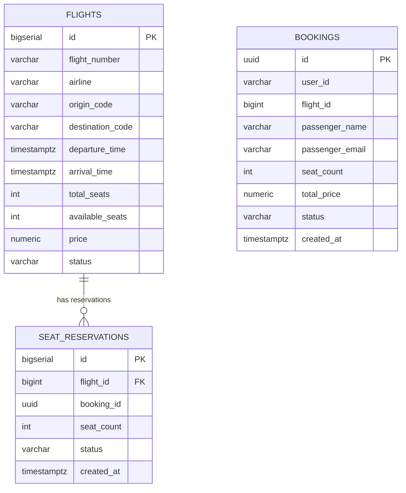

# HW3 — Flight Booking: gRPC + Redis

## Что было сделано

В этом домашнем задании я реализовал микросервисную систему бронирования авиабилетов из двух сервисов:

- **Booking Service** — REST API для клиентов
- **Flight Service** — gRPC сервис для работы с рейсами и местами

Архитектурно решение построено так:

```text
Client (REST) → Booking Service → (gRPC) → Flight Service
                      ↓                          ↓
                 PostgreSQL               PostgreSQL + Redis
```

---

## ER-диаграмма



ER-диаграмму я вынес в отдельный файл:

```text
hw3-flight-booking/er-diagram.mmd
```

---

## Структура проекта

```text
hw3-flight-booking/
├── booking-service/
│   ├── db.py
│   ├── flight.proto
│   ├── grpc_client.py
│   ├── main.py
│   ├── Dockerfile
│   ├── requirements.txt
│   └── migrations/V1__init.sql
├── flight-service/
│   ├── db.py
│   ├── flight.proto
│   ├── main.py
│   ├── Dockerfile
│   ├── requirements.txt
│   └── migrations/V1__init.sql
├── proto/
│   └── flight.proto
├── tests/
│   ├── conftest.py
│   └── test_retry.py
├── docker-compose.yml
├── er-diagram.mmd
└── README.md
```

---

## Что именно я реализовал по пунктам задания

## 1. Спроектировал доменную модель и ER-диаграмму

Сначала я выделил основные сущности системы:

- `flights` — рейсы
- `seat_reservations` — резерв мест на рейсе
- `bookings` — итоговые бронирования пользователя

Я разделил данные так, чтобы:
- Flight Service отвечал за рейсы и количество свободных мест
- Booking Service отвечал за пользовательские бронирования

Это позволило не смешивать ответственность сервисов и сделать модель ближе к реальной микросервисной архитектуре.

### Где это реализовано

ER-диаграмма:
```text
hw3-flight-booking/er-diagram.mmd
```

SQL-схема Flight Service:
```text
hw3-flight-booking/flight-service/migrations/V1__init.sql
```

SQL-схема Booking Service:
```text
hw3-flight-booking/booking-service/migrations/V1__init.sql
```

---

## 2. Поднял два отдельных сервиса и две отдельные базы данных

Я разнес систему на два сервиса:

### Booking Service
REST API, которое принимает HTTP-запросы от клиента.

### Flight Service
gRPC сервис, который:
- ищет рейсы
- отдает рейс по ID
- резервирует места
- освобождает резерв

Также я поднял **две отдельные PostgreSQL базы**:
- `flight_db`
- `booking_db`

Это сделано через `docker-compose.yml`.

### Где это реализовано

```text
hw3-flight-booking/docker-compose.yml
```

Сами сервисы:
```text
hw3-flight-booking/booking-service/
hw3-flight-booking/flight-service/
```

---

## 3. Описал gRPC контракт между сервисами

Для связи между сервисами я описал protobuf-контракт.

В контракт я вынес:
- сущность `Flight`
- сущность `SeatReservation`
- запросы и ответы для:
  - `SearchFlights`
  - `GetFlight`
  - `ReserveSeats`
  - `ReleaseReservation`

Это позволило сделать строго типизированное взаимодействие между сервисами.

### Где это реализовано

Основной proto-файл:
```text
hw3-flight-booking/proto/flight.proto
```

Копии proto для сборки контейнеров:
```text
hw3-flight-booking/booking-service/flight.proto
hw3-flight-booking/flight-service/flight.proto
```

---

## 4. Реализовал REST API в Booking Service

Booking Service я сделал на FastAPI.

Он предоставляет следующие endpoints:

- `GET /flights`
- `GET /flights/{flight_id}`
- `POST /bookings`
- `GET /bookings/{booking_id}`
- `POST /bookings/{booking_id}/cancel`
- `GET /bookings?user_id=...`

Через эти endpoints клиент взаимодействует только с REST API, а дальше Booking Service уже сам общается с Flight Service через gRPC.

### Что важно

Я также добавил валидацию `booking_id`, чтобы при передаче некорректного UUID сервис возвращал **400 Bad Request**, а не падал с 500 ошибкой.

### Где это реализовано

```text
hw3-flight-booking/booking-service/main.py
```

Ключевое место:
- функция `parse_booking_uuid()`
- обработчики `/bookings/{booking_id}`
- обработчик `/bookings/{booking_id}/cancel`

---

## 5. Реализовал логику Flight Service и работу с местами

Flight Service я сделал как gRPC сервер.

Он обрабатывает:

### `SearchFlights`
Поиск рейсов по маршруту и дате.

### `GetFlight`
Получение конкретного рейса по ID.

### `ReserveSeats`
Атомарное резервирование мест.

### `ReleaseReservation`
Освобождение мест при отмене бронирования.

Для бронирования я использовал транзакцию и блокировку строки рейса через:

```sql
SELECT * FROM flights WHERE id = $1 FOR UPDATE
```

Это нужно, чтобы два параллельных запроса не смогли одновременно забрать одни и те же места.

### Где это реализовано

```text
hw3-flight-booking/flight-service/main.py
```

Ключевые места:
- метод `ReserveSeats`
- метод `ReleaseReservation`

---

## 6. Реализовал идемпотентность резервирования

Один из важных пунктов — сделать резервирование идемпотентным.

Я использовал `booking_id` как идемпотентный ключ.

Перед созданием нового резерва Flight Service сначала проверяет, есть ли уже запись в `seat_reservations` с таким `booking_id`. Если запись уже существует, сервис не уменьшает места повторно, а возвращает уже существующую резервацию.

Это защищает систему от повторного выполнения одного и того же запроса.

### Где это реализовано

```text
hw3-flight-booking/flight-service/main.py
```

Ключевое место:
- начало метода `ReserveSeats`
- проверка `existing = await conn.fetchrow(...)`

Также уникальность `booking_id` поддерживается на уровне БД:

```text
hw3-flight-booking/flight-service/migrations/V1__init.sql
```

---

## 7. Добавил авторизацию между сервисами через API key

Чтобы запретить прямые вызовы Flight Service без внутреннего ключа, я добавил передачу `x-api-key` в gRPC metadata.

### Как это сделано

#### На стороне клиента
В Booking Service я реализовал `ApiKeyInterceptor`, который автоматически добавляет ключ ко всем gRPC вызовам.

#### На стороне сервера
Во Flight Service я реализовал `AuthInterceptor`, который проверяет `x-api-key` и отклоняет запросы без корректного значения.

### Где это реализовано

Клиентский interceptor:
```text
hw3-flight-booking/booking-service/grpc_client.py
```

Серверный interceptor:
```text
hw3-flight-booking/flight-service/main.py
```

---

## 8. Добавил retry с exponential backoff

Для временных сбоев сети и недоступности Flight Service я реализовал retry-логику в Booking Service.

Retry выполняется только для ошибок:

- `UNAVAILABLE`
- `DEADLINE_EXCEEDED`

Retry **не выполняется** для бизнес-ошибок:

- `NOT_FOUND`
- `RESOURCE_EXHAUSTED`
- `INVALID_ARGUMENT`

Схема backoff:
- 0.1 сек
- 0.2 сек
- 0.4 сек

### Где это реализовано

```text
hw3-flight-booking/booking-service/grpc_client.py
```

Ключевое место:
- функция `grpc_call_with_retry()`

### Тесты

Я отдельно написал тесты на retry:
- повтор при `UNAVAILABLE`
- отсутствие retry при бизнес-ошибках
- успешный второй вызов
- проверка exponential backoff

Файлы:
```text
hw3-flight-booking/tests/test_retry.py
hw3-flight-booking/tests/conftest.py
```

---

## 9. Добавил Redis кеширование

Чтобы снизить нагрузку на БД Flight Service, я реализовал кеширование в Redis.

### Что кешируется
- результат `GetFlight`
- результат `SearchFlights`

### Подход
Я использовал стратегию **Cache-Aside**:
1. Сначала проверяю Redis
2. Если кеша нет — иду в PostgreSQL
3. Записываю результат в Redis с TTL
4. При изменениях инвалидирую связанный кеш

### TTL
```text
CACHE_TTL = 600
```

### Инвалидация
После `ReserveSeats` и `ReleaseReservation` я:
- удаляю кеш конкретного рейса
- удаляю все поисковые ключи `search:*`

### Где это реализовано

```text
hw3-flight-booking/flight-service/main.py
```

Ключевые места:
- `get_redis()`
- `SearchFlights`
- `GetFlight`
- `ReserveSeats`
- `ReleaseReservation`

---

## 10. Добавил Redis Sentinel и проверил failover

После обычного Redis я расширил решение до отказоустойчивой схемы:

- `redis-master`
- `redis-replica`
- `redis-sentinel`

Теперь Flight Service работает не с обычным Redis напрямую, а через Sentinel и получает master через имя:

```text
mymaster
```

### Что я сделал

В `docker-compose.yml` я добавил:
- контейнер master
- контейнер replica
- контейнер sentinel

Во Flight Service я добавил режим работы:

- `REDIS_MODE=standalone`
- `REDIS_MODE=sentinel`

Когда включен режим `sentinel`, сервис подключается через:

- `REDIS_SENTINEL_HOST`
- `REDIS_SENTINEL_PORT`
- `REDIS_MASTER_NAME`

### Где это реализовано

Compose:
```text
hw3-flight-booking/docker-compose.yml
```

Подключение через Sentinel:
```text
hw3-flight-booking/flight-service/main.py
```

Ключевые места:
- переменные `REDIS_MODE`, `REDIS_MASTER_NAME`, `REDIS_SENTINEL_HOST`
- ветка `if REDIS_MODE == "sentinel":`

---

## 11. Реализовал circuit breaker

Чтобы Booking Service не продолжал бесконечно дергать недоступный Flight Service, я реализовал **Circuit Breaker**.

Состояния:
- `CLOSED`
- `OPEN`
- `HALF_OPEN`

### Логика
- пока ошибок мало — состояние `CLOSED`
- если в окне накопилось достаточно неуспешных вызовов — `OPEN`
- после таймаута делается пробный запрос — `HALF_OPEN`
- если пробный запрос успешен — возвращаемся в `CLOSED`

### Параметры
Задаются через environment variables:

- `CB_FAILURE_THRESHOLD`
- `CB_RESET_TIMEOUT`
- `CB_WINDOW_SIZE`

### Где это реализовано

```text
hw3-flight-booking/booking-service/grpc_client.py
```

Ключевые места:
- класс `CircuitBreaker`
- исключение `CircuitBreakerOpenError`
- интеграция в `grpc_call_with_retry()`

И обработка в REST API:
```text
hw3-flight-booking/booking-service/main.py
```

---

## 12. Исправил проблему после failover Redis

Во время проверки failover я обнаружил важный момент: после переключения master старое Redis-соединение внутри Flight Service могло стать невалидным.

Из-за этого сервис получал ошибку вида:
- `Connection closed by server`

После этого я доработал `flight-service/main.py`, чтобы Redis-клиент корректно переподключался после failover и не падал на старом соединении.

### Где это исправлено

```text
hw3-flight-booking/flight-service/main.py
```

Это была доработка поверх базовой Sentinel-схемы, чтобы система реально переживала переключение мастера.

---

## Как запускать проект

Из директории:

```text
hw3-flight-booking
```

Запуск:
```bash
docker compose up --build
```

---

## Как проверять

### Проверка REST API

Получить рейс:
```bash
curl http://localhost:8000/flights/1
```

Поиск рейсов:
```bash
curl "http://localhost:8000/flights?origin=SVO&destination=LED"
```

Создать бронирование:
```bash
curl -X POST "http://localhost:8000/bookings" \
  -H "Content-Type: application/json" \
  -d '{
    "user_id": "u1",
    "flight_id": 1,
    "passenger_name": "Ivan Ivanov",
    "passenger_email": "ivan@example.com",
    "seat_count": 2
  }'
```

Получить бронирование:
```bash
curl "http://localhost:8000/bookings/<BOOKING_ID>"
```

Отменить бронирование:
```bash
curl -X POST "http://localhost:8000/bookings/<BOOKING_ID>/cancel"
```

---

## Проверка retry и circuit breaker

Остановить Flight Service:
```bash
docker compose stop flight-service
```

Сделать несколько запросов:
```bash
curl http://localhost:8000/flights/1
```

Ожидаемое поведение:
- сначала идут retry
- потом circuit breaker открывается
- следующие запросы начинают возвращать `503 Service Unavailable`

После восстановления сервиса:
```bash
docker compose start flight-service
```

Circuit breaker должен перейти:
- `OPEN -> HALF_OPEN -> CLOSED`

---

## Проверка Redis Sentinel failover

Посмотреть master:
```bash
docker compose exec redis-sentinel redis-cli -p 26379 SENTINEL get-master-addr-by-name mymaster
```

Остановить master:
```bash
docker compose stop redis-master
```

Подождать несколько секунд и снова проверить:
```bash
docker compose exec redis-sentinel redis-cli -p 26379 SENTINEL get-master-addr-by-name mymaster
```

Ожидаемо Sentinel должен переключить master на replica.

---

## Тесты

Запуск тестов:
```bash
cd tests
python3 -m pytest -v
```

У меня тесты покрывают retry-логику и backoff.

---

## Основные файлы, которые я менял

### Flight Service
- `hw3-flight-booking/flight-service/main.py`
- `hw3-flight-booking/flight-service/db.py`
- `hw3-flight-booking/flight-service/migrations/V1__init.sql`

### Booking Service
- `hw3-flight-booking/booking-service/main.py`
- `hw3-flight-booking/booking-service/grpc_client.py`
- `hw3-flight-booking/booking-service/db.py`
- `hw3-flight-booking/booking-service/migrations/V1__init.sql`

### Контракты и инфраструктура
- `hw3-flight-booking/proto/flight.proto`
- `hw3-flight-booking/docker-compose.yml`
- `hw3-flight-booking/er-diagram.mmd`

### Тесты
- `hw3-flight-booking/tests/test_retry.py`
- `hw3-flight-booking/tests/conftest.py`

---

## Итог

В результате я собрал полноценную микросервисную систему, в которой есть:

- REST API для клиента
- gRPC взаимодействие между сервисами
- две отдельные БД
- транзакционное резервирование мест
- идемпотентность
- внутренняя авторизация по API key
- retry с exponential backoff
- circuit breaker
- кеширование в Redis
- Redis Sentinel с failover
- тесты на retry-механику

То есть я не просто поднял два сервиса, а довел решение до состояния, где оно уже умеет переживать сбои зависимостей и корректно работать при частичных отказах.
