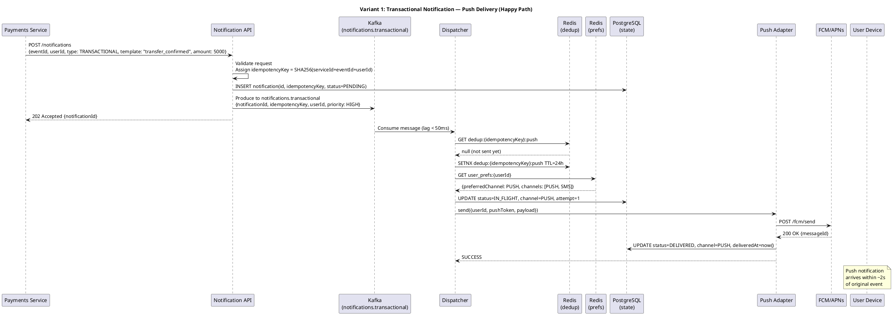
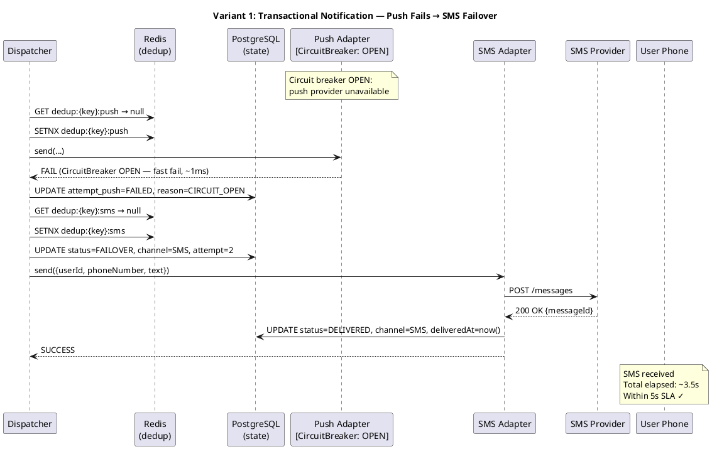
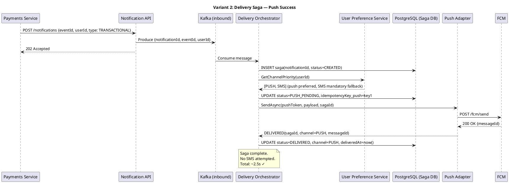
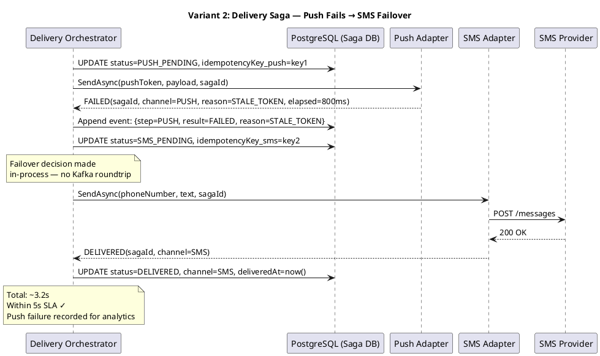

# Homework #4: Requirements and Architectural Thinking
## Notification Platform — Online Banking

---

## Task 1: Functional Requirements (1 point)

Minimum 5 functional requirements at the behavior level, linked to business goals.

| # | Priority | ID | Requirement |
|---|----------|----|-------------|
| 1 | MUST HAVE | FR1 | The system shall accept notification requests from any internal team (payments, transfers, products, marketing) through a single unified API, replacing per-team direct integrations with external providers. |
| 2 | MUST HAVE | FR2 | The system shall deliver transactional notifications (transfer confirmation, fund debit/credit) to the user through at least one available channel within the defined SLA from the moment the event occurs. |
| 3 | MUST HAVE | FR3 | The system shall automatically switch to a backup delivery channel (push → SMS → email) if the primary channel fails or is unavailable. |
| 4 | MUST HAVE | FR4 | The system shall ensure that the same notification is not delivered more than once to the same user on the same channel, even in the event of retries or failover. |
| 5 | MUST HAVE | FR5 | The system shall allow users to configure their notification preferences: choose a preferred delivery channel and opt out of non-critical notification types (service, marketing). Transactional notifications cannot be fully disabled. |
| 6 | MUST HAVE | FR6 | The system shall persist the delivery status of every notification (pending, in-flight, delivered, failed) and expose this status via an internal API for audit and support purposes. |
| 7 | SHOULD HAVE | FR7 | The system shall support mass campaign delivery targeting up to 1 million users in a single batch, with rate limiting and scheduling capabilities. |
| 8 | COULD HAVE | FR8 | The system shall expose a real-time delivery metrics dashboard to internal teams, showing delivery rates, failure rates, and SLA compliance per notification type. |

---

## Task 2: Non-Functional Requirements (1 point)

Minimum 5 NFRs at the architecture level, measurable.

| # | Priority | ID | Requirement |
|---|----------|----|-------------|
| 1 | MUST HAVE | NFR1 | **Latency:** Transactional notifications must be delivered within **5 seconds (P99)** from the moment the triggering event is published to the platform. |
| 2 | MUST HAVE | NFR2 | **Throughput:** The system must sustain a peak load of **50,000 notifications/minute** during mass marketing campaigns without degradation to transactional notification SLA. |
| 3 | MUST HAVE | NFR3 | **Availability:** The notification dispatch service must maintain **SLA ≥ 99.9%** (Business Operational tier — max ~8.7 hours downtime/year). |
| 4 | MUST HAVE | NFR4 | **Reliability:** Critical (transactional) notifications must have **at-least-once delivery guarantee**. The system must retry failed deliveries at least 3 times with exponential backoff before declaring a notification undeliverable. |
| 5 | MUST HAVE | NFR5 | **Scalability:** The system must support horizontal scaling to handle **up to 1 million notifications per batch campaign** without manual operator intervention, using autoscaling based on queue depth. |
| 6 | MUST HAVE | NFR6 | **Observability:** Every notification event must be traceable end-to-end via structured logs, metrics (Prometheus-compatible), and distributed traces (OpenTelemetry). Delivery success rate per channel must be observable in real time. |
| 7 | SHOULD HAVE | NFR7 | **Cost efficiency:** The system must prefer lower-cost delivery channels (push < email < SMS) unless user preferences or channel unavailability dictate otherwise. Estimated cost savings: ≥20% vs. current per-team SMS spend. |

**Load estimation:**

```
DAU: 3,000,000 users
Transactional notifications/user/day: 2   → 6,000,000 / day = ~70/sec average
Service notifications/user/day: 3         → 9,000,000 / day = ~104/sec average
Marketing notifications/user/day: 5       → 15,000,000 / day = ~174/sec average

Total average: ~350 notifications/sec
Peak (morning commute, mass campaign): ~835/sec (×2.4 factor assumed)
Mass campaign burst: 1,000,000 / (20 min) = ~835/sec sustained for 20 min
```

---

## Task 3: Architecturally Significant Requirements (ASR) (1 point)

### ASR1: Near-Instant Delivery of Transactional Notifications

**Linked requirements:** FR2 (transactional delivery within SLA), NFR1 (≤5s P99 latency)

**Why it affects architecture:**
Transactional notifications are critical — a user must know their payment was confirmed or their funds were debited within seconds. This forces the architecture to:
- Use **asynchronous, event-driven processing** (synchronous HTTP chains add too much latency and coupling)
- Maintain **separate high-priority processing lanes** isolated from bulk campaigns
- Eliminate blocking operations from the critical path (no synchronous DB lookups before dispatching)
- Define SLA monitoring with automated alerting when P99 exceeds threshold

---

### ASR2: At-Least-Once Delivery with Deduplication (Exactly-Once Semantics for User)

**Linked requirements:** FR4 (no duplicates), FR3 (failover), FR6 (delivery status), NFR4 (reliability)

**Why it affects architecture:**
The system must retry failed deliveries without sending duplicates. This is a fundamental tension (retry vs. idempotency) that shapes the entire delivery pipeline:
- Requires a **persistent notification state machine** (PENDING → IN_FLIGHT → DELIVERED / FAILED)
- Requires **idempotency keys** per notification event
- Requires a **deduplication check** before each channel attempt (e.g., Redis-based lock with TTL)
- A stateless fire-and-forget dispatcher cannot satisfy this requirement

---

### ASR3: Resilience to External Provider Failures

**Linked requirements:** FR3 (automatic failover), NFR3 (99.9% availability), NFR4 (at-least-once), NFR7 (cost optimization)

**Why it affects architecture:**
SMS and email providers are third-party services that can and do fail. The system must not be operationally coupled to any single provider:
- Requires **circuit breaker per provider** to avoid cascading failures
- Requires **fallback channel orchestration** with cost-ordered priority (push → email → SMS)
- Requires **dead letter queues** for notifications that exhausted all channels
- Shapes the retry topology: per-channel retry queues vs. central orchestrator model

---

### ASR4: Throughput Isolation Between Notification Priorities

**Linked requirements:** FR7 (1M campaigns), NFR2 (50K/min peak), NFR1 (transactional SLA), NFR5 (scalability)

**Why it affects architecture:**
A mass marketing campaign (1M users) must not cause transactional notifications to miss their ≤5s SLA. This **throughput isolation** requirement drives:
- **Separate topic/queue partitions per notification priority tier** in the message broker
- **Dedicated consumer groups** for each tier with independent autoscaling
- **Rate limiting per external provider** (token bucket) to respect quotas
- A shared single queue would allow low-priority bulk messages to starve high-priority ones

---

## Task 4: Key Architectural Questions (1 point)

### AQ1: How should priority queues be physically isolated to guarantee transactional SLA under campaign load?

**Generated by:** ASR1 (low latency), ASR4 (throughput isolation)

**Why important:** If transactional and marketing notifications share queue resources (broker partitions, consumer threads, or provider rate limit budgets), a 1M-user campaign spike will delay critical payment confirmations. The architecture must explicitly decide: separate broker topics with dedicated consumer pools, priority scheduling within a single topic, or fully separate pipeline deployments? This decision has major implications for infrastructure cost and operational complexity.

---

### AQ2: Where and how is delivery state persisted to enable safe, idempotent failover?

**Generated by:** ASR2 (at-least-once + dedup), ASR3 (provider resilience)

**Why important:** Failover (switching from push to SMS after failure) requires knowing: was push genuinely undelivered, or did we just not receive an ACK? Without durable per-notification state, retries risk double-delivery. The choice of state store (relational DB, Redis, event sourcing) and the state transition model define whether the system can be operationally correct under failure. Wrong answer here means real-money notifications arriving twice.

---

### AQ3: How should the system handle back-pressure and rate-limit signals from external providers?

**Generated by:** ASR3 (provider resilience), ASR4 (throughput), NFR7 (cost)

**Why important:** SMS providers enforce per-second quotas and return HTTP 429 errors under overload. Without back-pressure handling, the dispatcher will overflow retry queues, exhaust provider quotas, and incur significant overage costs. The architecture must define: adaptive rate limiting, per-provider throttle buckets, and whether to shed load (drop marketing) vs. buffer (delay marketing) under pressure — with different answers for transactional vs. non-critical types.

---

## Task 5: Architectural Consequences of ASR (1 point)

### ASR1 (Near-Instant Delivery) → Consequences

- **Separate high-priority Kafka topic** (`notifications.transactional`) with dedicated partitions and consumer group, never shared with bulk traffic
- **Consumer polling interval ≤ 100ms** on the transactional dispatcher
- **No synchronous blocking calls** in the hot path (user preference lookup must be pre-cached in Redis, not fetched from DB at dispatch time)
- **P99 latency SLO alert** fires when transactional delivery exceeds 5s; PagerDuty escalation within 1 minute

### ASR2 (At-Least-Once + Deduplication) → Consequences

- **Notification state machine** persisted in PostgreSQL: `PENDING → CHANNEL_ATTEMPTED → DELIVERED | CHANNEL_FAILED → FAILOVER | EXHAUSTED`
- **Idempotency key** = SHA256(sourceServiceId + eventId + userId) stored per channel attempt
- **Deduplication check** using Redis SET with 24h TTL before each send attempt; if key exists, skip and mark as duplicate
- **Outbox pattern** in source services: event written to DB outbox table atomically with business transaction, then polled by CDC connector — prevents lost events on crash

### ASR3 (Provider Resilience) → Consequences

- **Circuit breaker per provider** (Resilience4j or equivalent): CLOSED → OPEN after 5 consecutive failures, HALF-OPEN probe every 30s
- **Fallback priority chain**: push (cheapest, fastest) → email (medium cost) → SMS (most expensive, most reliable)
- **Dead letter queue** (`notifications.dlq`) for notifications that fail all channels; ops team alerted immediately for transactional type
- **Provider health metrics**: per-provider success rate, p99 latency, circuit state exposed in Grafana

### ASR4 (Throughput Isolation) → Consequences

- **Three separate Kafka topics** by priority: `notifications.transactional`, `notifications.service`, `notifications.marketing`
- **Independent consumer groups** with separate autoscaling policies: transactional (min 3, max 10 pods), marketing (min 1, max 50 pods)
- **Token bucket rate limiter per provider**: SMS provider allows 100 req/s → token bucket refills at 100/s, shared across all marketing consumers
- **Batch send API** used for email/push providers during campaigns (send up to 1000 recipients per API call) to maximize throughput efficiency

---

## Task 6: Architectural Solutions That DON'T Fit (1 point)

### Anti-Solution 1: Synchronous REST chain for notification delivery

**What:** Each source service (payments, transfers) makes a direct synchronous HTTP POST to the Notification Service, which then synchronously calls the external SMS/push/email provider and returns a success/failure response.

**ASR violated:** ASR1 (≤5s latency), ASR3 (provider resilience)

**Why:**
External providers (especially SMS) can have response times of 1–10 seconds and occasional timeouts of 30+ seconds. In a synchronous chain, this blocks the source service's transaction thread, coupling bank core operations to third-party reliability. A provider outage would cause payment confirmation endpoints to start timing out. The source service would need to implement its own retry logic, recreating the decentralized problem we're trying to solve. Synchronous design also makes it impossible to guarantee the ≤5s SLA because latency is additive across the chain.

---

### Anti-Solution 2: Single shared FIFO queue for all notification types

**What:** All notifications — transactional, service, and marketing — are published to a single queue and processed by one shared pool of worker processes.

**ASR violated:** ASR4 (throughput isolation), ASR1 (low latency)

**Why:**
A mass marketing campaign (1,000,000 messages) fills the queue. A transactional notification (payment confirmed) is enqueued behind 999,999 marketing messages. At 835 messages/second processing rate, the transactional notification waits ~20 minutes — orders of magnitude beyond the 5-second SLA. There is no way to honor priority without queue isolation. This is a fundamental property of FIFO queues: they cannot distinguish urgency.

---

### Anti-Solution 3: Stateless fire-and-forget dispatcher (no delivery state)

**What:** The dispatcher sends each notification to the provider and does not persist any state about the attempt or outcome. Retries are handled only at the message broker level (message redelivery on consumer crash).

**ASR violated:** ASR2 (at-least-once with deduplication), ASR3 (provider resilience)

**Why:**
Without per-notification delivery state, the failover logic cannot determine whether push was actually delivered or just unacknowledged. If the dispatcher crashes after push succeeds but before acknowledging the message, the broker redelivers it — and push is attempted again (duplicate). Conversely, if push failed silently (provider accepted the request but dropped it), there's no record to trigger SMS fallover. Correct cross-channel failover is logically impossible without a state machine tracking which channels have been tried and what their outcome was.

---

## Task 7: Uncertainties and Architectural Risks (1 point)

### Uncertainty 1: Real-world failure rate and failure mode of external SMS/email providers

**What's unknown:**
We don't have empirical data on how frequently SMS/email providers fail, for how long, what error codes they return, and whether failures are total outages or partial degradations (e.g., 5% of requests timeout). This affects circuit breaker thresholds (too sensitive = false trips; too lenient = SLA violations), retry backoff intervals, and whether SMS can realistically serve as a reliable final fallback for critical notifications.

**How to verify:**
- Instrument a 4-week shadow mode: route a copy of all outbound notifications through the new platform's provider adapters (without actually sending) and log all response codes, latencies, and error rates
- Review contractual SLA documents from provider (if any)
- Load test against provider sandboxes to measure behavior under burst traffic

---

### Uncertainty 2: Business definition of "guaranteed delivery" when user has opted out of all channels

**What's unknown:**
If a user disables push and SMS (only keeps email), and the email provider is down, is the notification "undeliverable" — or does the system override user preferences for transactional types? There's a legal and product dimension (regulatory requirement to notify users of debits) that hasn't been defined. The architecture must either enforce a mandatory channel that cannot be disabled, or accept that transactional notifications can be missed if the user has configured it so.

**How to verify:**
- Legal/compliance review: are there regulatory requirements (e.g., PSD2, GDPR) mandating notification of fund movements?
- Product decision: define a "mandatory notification" category that cannot be fully opted out of, with push as fallback always enabled
- User research: survey what % of users would disable all channels, to quantify the risk

---

---

# RFC: Guaranteed Delivery of Critical Notifications with Cross-Channel Failover

| Metadata | Value |
|----------|-------|
| **Status** | DESIGN |
| **Author(s)** | [Author Name] |
| **Owner** | [Owner Name] |
| **Business Sponsor** | [Sponsor Name] |
| **Reviewers** | [Names, Dates] |
| **Created** | 2026-04-06 |
| **Updated** | 2026-04-06 |

---

## Table of Contents

1. [Context](#context)
2. [User Scenarios](#user-scenarios)
3. [Requirements](#requirements)
4. [Solution Variants](#solution-variants)
5. [Comparative Analysis](#comparative-analysis)
6. [Conclusions](#conclusions)
7. [Appendix](#appendix)

---

## Context

### Problem Statement

Transactional notifications (transfer confirmation, fund debit, payment execution) are the highest-criticality messages in the Notification Platform. Their non-delivery or delayed delivery directly impacts user trust, financial safety, and regulatory compliance.

The current state — each team independently integrating with SMS/email providers — provides no guarantee of delivery, no cross-channel failover, and no deduplication. The new Notification Platform must solve this with a dedicated subsystem for guaranteed delivery.

Each delivery channel has distinct reliability, cost, and latency characteristics:
- **Push** — fastest, cheapest, but requires app installation and active device; can be silently dropped by OS
- **SMS** — highest reliability and reach, but ~50–100× more expensive than push, and providers have rate limits
- **Email** — low cost, reliable, but inappropriate for time-critical sub-5s notifications

External SMS and email providers can become temporarily unavailable due to outages, quota exhaustion, or network issues.

### Key Questions
- How do we guarantee a critical notification reaches the user through at least one channel?
- How do we avoid duplicating a notification that was already delivered when failing over?
- How do we minimize SMS cost while maintaining the delivery guarantee?
- How do we observe and alert on delivery failures in real time?

### Scale

```
MAU:  10,000,000  users
DAU:   3,000,000  users
Peak concurrent users: 300,000

Transactional notifications:  2/user/day × 3M DAU =  6,000,000/day ≈  70/sec avg
                               Peak (morning): ≈ 200/sec
                               Mass campaign burst: up to 1M/batch

Transactional SLA: delivery within 5 seconds P99 from event publication
```

---

## User Scenarios

| Priority | Type | Actor | Scenario |
|----------|------|--------|----------|
| MUST HAVE | Happy path | Bank customer | User makes a P2P transfer; within 3 seconds receives a push notification confirming the debit. |
| MUST HAVE | Failover | Bank customer | User's push token is stale (device changed). System detects push failure, automatically sends SMS within 5 seconds total from event time. |
| MUST HAVE | Deduplication | Bank customer | Push delivery confirmation is delayed due to network; system schedules SMS failover. Before SMS is sent, push ACK arrives. System cancels SMS — user receives only one notification. |
| MUST HAVE | User preference | Bank customer | User has set SMS as preferred channel. System routes transactional notifications to SMS first, skipping push. |
| SHOULD HAVE | All-channel failure | Bank customer | Both push and SMS fail. System attempts email. If email also fails, notification is placed in DLQ and ops team is alerted. |
| SHOULD HAVE | Observability | On-call engineer | Engineer receives PagerDuty alert: transactional push delivery rate dropped below 90%. Opens Grafana dashboard to see circuit breaker state and per-channel error rates. |
| COULD HAVE | Forced re-delivery | Support operator | Support agent triggers re-delivery of a specific failed transactional notification from the admin panel. |

---

## Requirements

### Functional Requirements (Subsystem-Specific)

| # | Priority | ID | Requirement |
|---|----------|----|-------------|
| 1 | MUST HAVE | FR-GD-1 | The subsystem shall accept a transactional notification event and guarantee delivery to at least one channel within 5 seconds P99. |
| 2 | MUST HAVE | FR-GD-2 | The subsystem shall implement channel failover: if the primary channel fails, it must automatically attempt the next channel in the user's priority chain. |
| 3 | MUST HAVE | FR-GD-3 | The subsystem shall not deliver the same notification more than once across all channels combined (deduplication across failover attempts). |
| 4 | MUST HAVE | FR-GD-4 | The subsystem shall respect user channel preferences (preferred channel, mandatory channels that cannot be opted out of). |
| 5 | MUST HAVE | FR-GD-5 | The subsystem shall persist the complete delivery attempt history per notification and expose it via internal API. |
| 6 | MUST HAVE | FR-GD-6 | The subsystem shall place exhausted notifications (all channels failed) into a dead letter queue and trigger an operational alert. |
| 7 | SHOULD HAVE | FR-GD-7 | The subsystem shall prefer lower-cost channels over higher-cost ones when user preferences allow, to minimize SMS spend. |

### Non-Functional Requirements (Subsystem-Specific)

| # | Priority | ID | Requirement |
|---|----------|----|-------------|
| 1 | MUST HAVE | NFR-GD-1 | Transactional notification delivery: **≤5s P99** end-to-end latency. |
| 2 | MUST HAVE | NFR-GD-2 | Delivery success rate for transactional notifications: **≥99.5%** (at least one channel reached) over any 24h window. |
| 3 | MUST HAVE | NFR-GD-3 | Subsystem availability: **≥99.9%** (must not be a single point of failure for the banking platform). |
| 4 | MUST HAVE | NFR-GD-4 | Deduplication accuracy: **0 duplicate deliveries** for transactional notifications under normal failover conditions. |
| 5 | MUST HAVE | NFR-GD-5 | Full distributed traceability: every notification event traceable from API ingestion to final delivery ACK or DLQ placement via trace ID. |
| 6 | SHOULD HAVE | NFR-GD-6 | SMS fallover rate: **≤15%** of transactional notifications should require SMS (push should handle ≥85%). Cost target. |

---

## Solution Variants

---

### Variant 1: Event-Driven Pipeline with Priority Lanes and Circuit Breakers

#### Description

An event-driven architecture where each notification enters a priority-isolated Kafka topic and is processed by a stateless Dispatcher service backed by a Delivery State Store. Each channel adapter (Push, SMS, Email) wraps its external provider with a circuit breaker. Failover is triggered reactively: the Dispatcher receives a FAILED event from a channel adapter and schedules the next channel attempt by publishing to the same high-priority topic with updated metadata.

#### C4 Container Diagram (PlantUML)

```plantuml
@startuml C4_Container_Variant1
!include https://raw.githubusercontent.com/plantuml-stdlib/C4-PlantUML/master/C4_Container.puml

title Variant 1: Event-Driven Pipeline with Circuit Breakers

Person(user, "Bank Customer", "Receives notifications on mobile/email")

System_Boundary(np, "Notification Platform") {
    Container(api, "Notification API", "REST/gRPC", "Receives notification requests from internal services. Validates, enriches with user prefs, assigns idempotency key.")
    
    ContainerDb(statedb, "Delivery State Store", "PostgreSQL", "Persists notification state machine: PENDING → IN_FLIGHT → DELIVERED | FAILED → FAILOVER | EXHAUSTED")
    
    ContainerDb(dedupstore, "Dedup Cache", "Redis", "Idempotency keys with 24h TTL. Prevents duplicate channel attempts on retry.")
    
    ContainerDb(prefcache, "User Preference Cache", "Redis", "Cached user channel preferences. Refreshed on update. TTL 5min.")
    
    Container(broker, "Message Broker", "Apache Kafka", "Topics: notifications.transactional (priority), notifications.service, notifications.marketing, notifications.retry, notifications.dlq")
    
    Container(dispatcher, "Transactional Dispatcher", "Go / Java", "Consumes from notifications.transactional. Resolves channel order from user prefs cache. Checks dedup cache. Writes state. Calls channel adapter.")
    
    Container(pushadapter, "Push Adapter", "Go", "Wraps FCM/APNs. Circuit breaker (Resilience4j). Returns ACK or FAILED event.")
    
    Container(smsadapter, "SMS Adapter", "Go", "Wraps SMS provider (e.g. Twilio/SMSC). Circuit breaker. Returns ACK or FAILED event.")
    
    Container(emailadapter, "Email Adapter", "Go", "Wraps SMTP/SES. Circuit breaker.")
    
    Container(dlqhandler, "DLQ Handler", "Go", "Consumes from notifications.dlq. Alerts ops (PagerDuty). Exposes admin re-delivery API.")
    
    Container(observability, "Observability Stack", "Prometheus + Grafana + Jaeger", "Metrics, dashboards, distributed traces.")
}

System_Ext(fcm, "FCM / APNs", "Push notification providers")
System_Ext(smsprovider, "SMS Provider", "e.g. Twilio, SMSC")
System_Ext(emailprovider, "Email Provider", "AWS SES / SMTP")
System_Ext(internalservices, "Internal Services", "Payments, Transfers, Products")

Rel(internalservices, api, "POST /notifications", "gRPC/REST")
Rel(api, broker, "Publish to notifications.transactional", "Kafka Producer")
Rel(api, statedb, "Insert PENDING state", "JDBC")
Rel(dispatcher, broker, "Consume notifications.transactional", "Kafka Consumer")
Rel(dispatcher, dedupstore, "Check/set idempotency key", "Redis GET/SET")
Rel(dispatcher, prefcache, "Resolve channel priority", "Redis GET")
Rel(dispatcher, statedb, "Update state → IN_FLIGHT", "JDBC")
Rel(dispatcher, pushadapter, "Send push", "Internal call")
Rel(dispatcher, smsadapter, "Send SMS (failover)", "Internal call")
Rel(dispatcher, emailadapter, "Send email (failover)", "Internal call")
Rel(pushadapter, fcm, "FCM/APNs API", "HTTPS")
Rel(smsadapter, smsprovider, "SMS API", "HTTPS")
Rel(emailadapter, emailprovider, "SMTP/API", "HTTPS")
Rel(pushadapter, statedb, "Update state → DELIVERED/FAILED", "Event")
Rel(dispatcher, broker, "Publish to notifications.dlq (if exhausted)", "Kafka Producer")
Rel(dlqhandler, broker, "Consume notifications.dlq", "Kafka Consumer")
Rel(user, fcm, "Receives push", "")
Rel(user, smsprovider, "Receives SMS", "")

@enduml
```

#### Sequence Diagram — Happy Path (Push Delivers)



#### Sequence Diagram — Failover Path (Push Fails → SMS)



#### How Variant 1 satisfies each ASR

| ASR | How Satisfied |
|-----|---------------|
| ASR1 (≤5s latency) | Dedicated Kafka topic with high-priority consumer. Circuit breaker fails fast (~1ms) instead of waiting for provider timeout. No blocking DB lookups in hot path (Redis cache). |
| ASR2 (at-least-once + dedup) | Idempotency key checked in Redis before each channel attempt. State machine in PostgreSQL tracks all attempts. SETNX atomically prevents concurrent duplicate sends. |
| ASR3 (provider resilience) | Circuit breaker per adapter. Fast-fail to next channel. Dead letter queue for full exhaustion. |
| ASR4 (throughput isolation) | Separate Kafka topic `notifications.transactional` with dedicated consumer group, independent of service/marketing topics. |

#### Technologies

- **Message broker:** Apache Kafka (managed: Confluent Cloud or Amazon MSK)
- **State store:** PostgreSQL 15 (with row-level locking for state transitions)
- **Dedup/cache:** Redis 7 (Redis Cluster for HA)
- **Dispatcher:** Go service (low latency, high concurrency)
- **Circuit breaker:** Resilience4j (if JVM) or custom Go implementation with sliding window
- **Push provider:** FCM (Android), APNs (iOS)
- **SMS provider:** Twilio or SMPP-based SMSC
- **Email provider:** AWS SES
- **Observability:** OpenTelemetry SDK → Jaeger (traces), Prometheus (metrics), Grafana (dashboards)

#### Advantages
- Simple, battle-tested event-driven pattern
- High throughput naturally (Kafka partitioning)
- Each component independently deployable and scalable
- Circuit breaker provides sub-millisecond fast-fail (preserves SLA even when provider is slow)
- Kafka consumer offset ensures no message loss on dispatcher crash

#### Disadvantages
- Failover logic is distributed across dispatcher iterations — harder to reason about complex multi-step scenarios
- Requires careful coordination between Kafka offset commit and state DB update (two-phase write risk)
- Redis dedup + Kafka + PostgreSQL = three systems to operate; higher operational complexity
- Long failover chains (push → SMS → email) require multiple Kafka topic roundtrips or synchronous retries within consumer

---

### Variant 2: Delivery Orchestrator with Saga State Machine

#### Description

A centralized Delivery Orchestrator service manages the entire lifecycle of each transactional notification delivery as an explicit Saga. When a notification arrives, the Orchestrator creates a delivery workflow instance (persisted in the DB), and executes steps sequentially: resolve channels → attempt push → evaluate result → attempt SMS if needed → attempt email if needed → mark exhausted. The Orchestrator is the single source of truth for delivery state, and communicates with channel adapters via internal async calls with callbacks. No Kafka roundtrips between failover steps — the Orchestrator drives the saga in-process.

#### C4 Container Diagram (PlantUML)

```plantuml
@startuml C4_Container_Variant2
!include https://raw.githubusercontent.com/plantuml-stdlib/C4-PlantUML/master/C4_Container.puml

title Variant 2: Delivery Orchestrator with Saga State Machine

Person(user, "Bank Customer")

System_Boundary(np, "Notification Platform") {
    Container(api, "Notification API", "REST/gRPC", "Receives events from internal services. Validates and enqueues.")
    
    Container(broker, "Inbound Queue", "Apache Kafka", "Topic: notifications.transactional.inbound — single ingestion point. No failover logic here.")
    
    Container(orchestrator, "Delivery Orchestrator", "Java/Spring / Go", "Core service. Manages Saga per notification. Persists delivery workflow. Drives channel attempts in sequence. Owns all retry and failover logic.")
    
    ContainerDb(sagadb, "Saga State DB", "PostgreSQL", "Delivery workflow instances. State: CREATED → PUSH_ATTEMPTED → PUSH_OK/PUSH_FAILED → SMS_ATTEMPTED → ... → DELIVERED | EXHAUSTED. Append-only event log per notification.")
    
    ContainerDb(dedupstore, "Dedup Store", "PostgreSQL / Redis", "Idempotency keys per notificationId+channel. Checked atomically within Saga step.")
    
    ContainerDb(prefservice, "User Preference Service", "gRPC", "Returns user channel order and mandatory channels. Orchestrator calls once per saga.")
    
    Container(pushadapter, "Push Adapter", "Go", "Thin wrapper over FCM/APNs. Exposes async send API with callback. Internal to platform.")
    Container(smsadapter, "SMS Adapter", "Go", "Thin wrapper over SMS provider. Async send with callback.")
    Container(emailadapter, "Email Adapter", "Go", "Thin wrapper over SES/SMTP.")
    
    Container(dlqservice, "DLQ & Alert Service", "Go", "Receives EXHAUSTED notifications from Orchestrator. Persists to DLQ table. Fires PagerDuty/Slack alert.")
    
    Container(observability, "Observability", "OTel + Prometheus + Grafana", "Traces span the entire saga. Dashboard per-channel success rate, saga duration.")
}

System_Ext(fcm, "FCM / APNs")
System_Ext(smsprovider, "SMS Provider")
System_Ext(emailprovider, "Email Provider")
System_Ext(internalservices, "Internal Services")

Rel(internalservices, api, "POST /notifications", "gRPC")
Rel(api, broker, "Produce to inbound topic", "Kafka")
Rel(broker, orchestrator, "Consume inbound", "Kafka Consumer")
Rel(orchestrator, sagadb, "Create/update Saga instance", "JDBC")
Rel(orchestrator, dedupstore, "Dedup check per step", "Redis/JDBC")
Rel(orchestrator, prefservice, "Get channel priority", "gRPC")
Rel(orchestrator, pushadapter, "Attempt push", "async gRPC")
Rel(orchestrator, smsadapter, "Attempt SMS (failover)", "async gRPC")
Rel(orchestrator, emailadapter, "Attempt email (failover)", "async gRPC")
Rel(pushadapter, fcm, "FCM API", "HTTPS")
Rel(smsadapter, smsprovider, "SMS API", "HTTPS")
Rel(emailadapter, emailprovider, "SMTP/API", "HTTPS")
Rel(orchestrator, dlqservice, "Notify EXHAUSTED", "internal event")

@enduml
```

#### Sequence Diagram — Happy Path



#### Sequence Diagram — Failover Path



#### How Variant 2 satisfies each ASR

| ASR | How Satisfied |
|-----|---------------|
| ASR1 (≤5s latency) | Failover steps execute in-process within the Orchestrator (no Kafka roundtrip between steps). Fast-fail on push error triggers SMS without broker round-trip overhead (~50ms saved per failover step). |
| ASR2 (at-least-once + dedup) | Idempotency key per step is written to Saga DB atomically with step creation. Saga state machine prevents re-attempting a step that already DELIVERED. Explicit DELIVERED state guards against re-delivery. |
| ASR3 (provider resilience) | Circuit breaker per adapter inside Orchestrator. FAILED callback triggers immediate next-channel attempt in-process. Saga records full attempt history for DLQ analysis. |
| ASR4 (throughput isolation) | Orchestrator instances can be scaled independently per notification type. Separate Kafka consumer groups. Saga DB partitioned by notification type. |

#### Technologies

- **Message broker:** Apache Kafka (ingestion layer only)
- **Saga state:** PostgreSQL 15 with append-only event log (event sourcing per notification)
- **Dedup:** Idempotency key in Saga DB (same DB, no extra system needed)
- **Orchestrator:** Java (Spring Boot) or Go — stateless, horizontally scalable
- **Channel adapters:** Go microservices with gRPC interface, async callback model
- **Push:** FCM + APNs
- **SMS:** Twilio / SMPP SMSC
- **Email:** AWS SES
- **Circuit breaker:** Resilience4j (Java) / go-hystrix
- **Observability:** OpenTelemetry (one trace per saga, spans per step), Prometheus, Grafana, Alertmanager

#### Advantages
- Failover logic centralized in one place — easier to understand, test, and change
- No Kafka round-trips between failover steps → lower latency on failover paths
- Saga DB is the single source of truth — simpler operationally (no Redis + Kafka + DB to reconcile)
- Full audit log of every delivery step per notification (append-only event log)
- Easier to add new failover rules (e.g., "try push twice before SMS") without topology changes

#### Disadvantages
- Orchestrator is a more complex service (must handle concurrent sagas, timeouts, partial failures)
- Saga DB can become a write bottleneck at very high throughput (70+ sagas/sec for transactional alone); requires careful indexing and partitioning
- Coupling: channel adapters must implement callback interface to Orchestrator (vs. event-driven decoupling in Variant 1)
- Harder to independently scale individual channel adapters without coordinating with Orchestrator

---

## Comparative Analysis

### Resource Requirements

| Criterion | Variant 1: Event-Driven Pipeline | Variant 2: Delivery Orchestrator |
|-----------|----------------------------------|----------------------------------|
| Implementation time | ~8 weeks | ~10 weeks |
| Team | 3 backend engineers, 1 SRE | 4 backend engineers, 1 SRE |
| Infrastructure | Kafka + PostgreSQL + Redis | Kafka + PostgreSQL (larger, partitioned) |
| Operational complexity | Higher (3 independent data stores to reconcile) | Medium (Saga DB is source of truth) |
| Organizational risk | Channel adapters fully decoupled — can be owned by different teams | Orchestrator must be owned by one central team |

### Requirement Compliance

| Requirement | Variant 1 | Variant 2 |
|-------------|-----------|-----------|
| FR-GD-1 (guarantee delivery ≤5s) | ✅ Yes | ✅ Yes |
| FR-GD-2 (automatic failover) | ✅ Yes | ✅ Yes |
| FR-GD-3 (deduplication) | ✅ Yes (Redis + state DB) | ✅ Yes (Saga DB atomic) |
| FR-GD-4 (user preferences) | ✅ Yes | ✅ Yes |
| FR-GD-5 (delivery history API) | ✅ Yes | ✅ Yes (richer event log) |
| FR-GD-6 (DLQ + alerting) | ✅ Yes | ✅ Yes |
| NFR-GD-1 (≤5s P99 latency) | ✅ Yes (fast-fail CB) | ✅ Yes (in-process failover) |
| NFR-GD-2 (≥99.5% delivery success) | ✅ Yes | ✅ Yes |
| NFR-GD-3 (≥99.9% availability) | ✅ Yes (stateless dispatcher) | ✅ Yes (stateless orchestrator) |
| NFR-GD-4 (0 duplicate deliveries) | ✅ Yes | ✅ Yes (stronger guarantee) |
| NFR-GD-5 (full traceability) | ✅ Yes | ✅ Yes (full saga event log) |
| ASR1 (near-instant delivery) | ✅ | ✅ Slight edge (no broker roundtrip on failover) |
| ASR2 (at-least-once + dedup) | ✅ | ✅ Slight edge (atomic in Saga DB) |
| ASR3 (provider resilience) | ✅ | ✅ |
| ASR4 (throughput isolation) | ✅ | ✅ |

---

## Conclusions

**Recommendation: Variant 2 — Delivery Orchestrator with Saga State Machine**

**Justification:**

The core requirement of this RFC is **correctness under failure**: guaranteed delivery with zero duplicates when channels fail and failover occurs. Variant 2 provides stronger correctness guarantees because:

1. **Failover atomicity:** In Variant 1, the gap between Kafka consumer acknowledgment and state DB update creates a window where a dispatcher crash could result in a lost failover step. In Variant 2, the Saga step transition is an atomic DB write within the Orchestrator — no two-phase write across heterogeneous systems.

2. **Deduplication simplicity:** Variant 2 stores idempotency keys in the same PostgreSQL database as the Saga state, enabling atomic check-and-set within a single transaction. Variant 1 requires Redis SET to be consistent with Kafka offset commit — an eventually consistent boundary.

3. **Failover latency:** In Variant 2, when push fails, the Orchestrator immediately proceeds to SMS in-process (~50ms). In Variant 1, the dispatcher must either do multiple synchronous retries within the consumer (blocking) or republish to Kafka and wait for the next consumer poll — adding 100–300ms per failover hop.

4. **Operational clarity:** The Saga event log in Variant 2 provides a complete, queryable history of every delivery attempt per notification, making support investigations and SLA audits straightforward. Variant 1 requires correlating Kafka consumer logs, Redis state, and PostgreSQL records.

**Trade-off accepted:** Variant 2 requires a more complex Orchestrator service and a higher-throughput PostgreSQL setup (partitioned by notification type). This additional engineering investment (~2 weeks) is justified given the financial and regulatory criticality of transactional notifications. A delivery bug that sends duplicate payment confirmations is significantly more costly to the business than 2 extra weeks of development.

**Phasing:** Deliver Variant 2 for transactional notifications first (highest criticality). Service and marketing notifications can use Variant 1 (simpler pipeline) since deduplication guarantees are less critical for those types.

---

## Appendix

### Glossary

| Term | Definition |
|------|------------|
| ASR | Architecturally Significant Requirement — a requirement that has a direct, material impact on architectural decisions |
| Circuit Breaker | A stability pattern that stops calling a failing service for a period after a threshold of errors, preventing cascading failures |
| Dead Letter Queue (DLQ) | A queue that holds messages that could not be successfully delivered after exhausting all retry and failover attempts |
| Failover | The automatic switch to a backup delivery channel when the primary channel fails |
| Idempotency Key | A unique key that identifies an operation; re-submitting the same key is safe and will not cause duplicate processing |
| Saga | A pattern for managing distributed long-running transactions as a sequence of steps with compensating actions on failure |
| SLA | Service Level Agreement — a committed performance threshold (e.g., ≤5s P99 delivery latency) |
| P99 | The 99th percentile of a latency distribution — 99% of requests complete within this time |
| Transactional Notification | A notification triggered by a financial event (transfer, debit, credit); highest criticality type |
| Outbox Pattern | Write the notification event to a DB outbox table atomically with the business transaction; a CDC connector then reliably publishes it to Kafka |
| CDC | Change Data Capture — mechanism for detecting and streaming DB row changes (e.g., Debezium) |
| Token Bucket | A rate-limiting algorithm that allows bursts up to bucket capacity, refilling at a steady rate |
